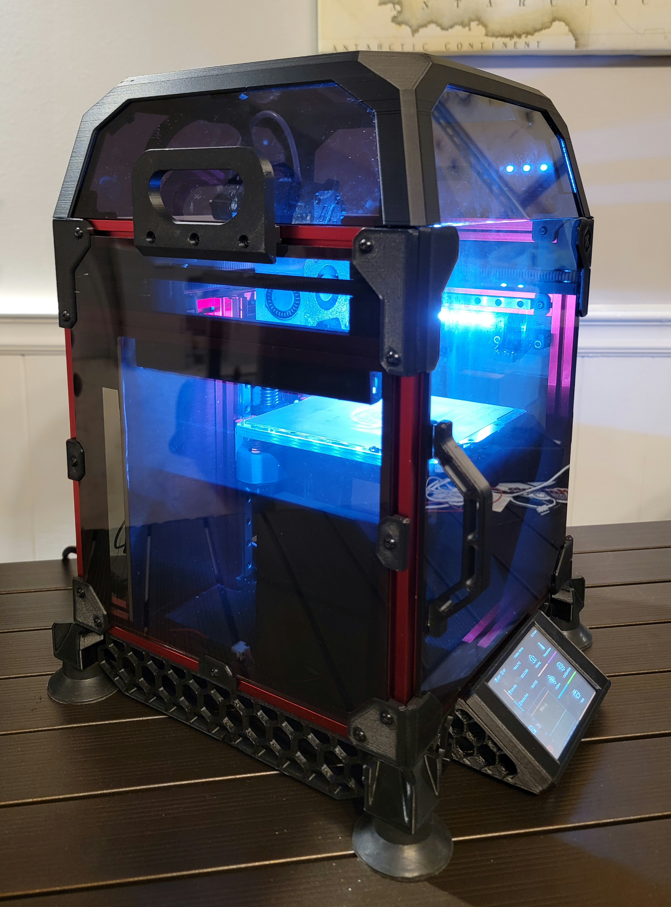
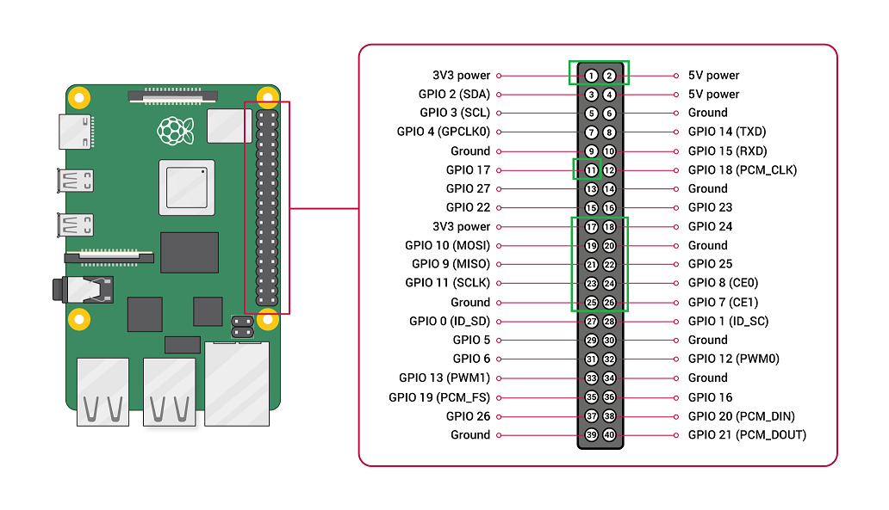
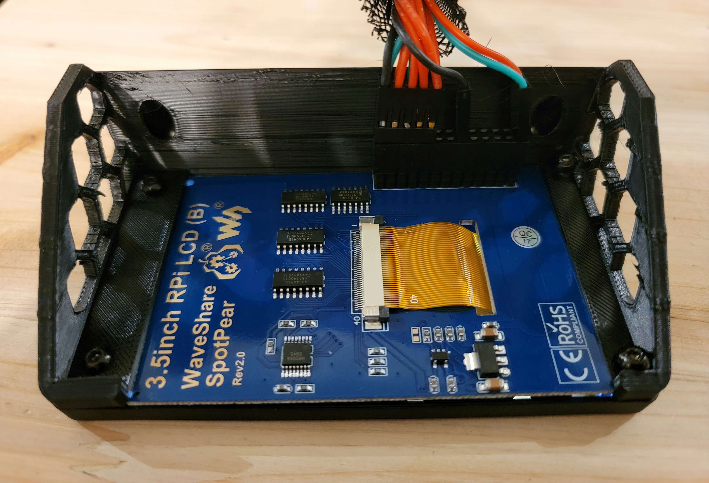
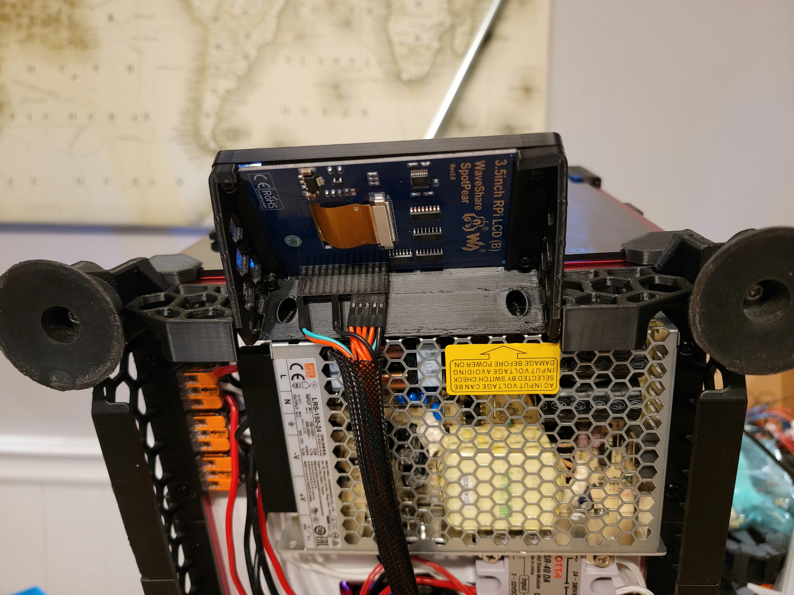
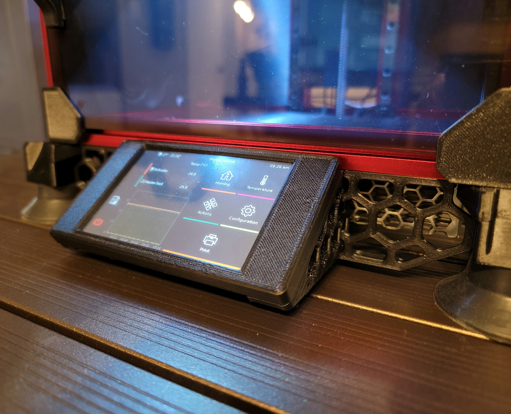

# Voron0 Waveshare 3.5" Display Mount

This mod will allow you to mount a 3.5" Waveshare on a Voron 0 so that you can use KlipperScreen.

## BOM

- <a href="https://www.waveshare.com/wiki/3.5inch_RPi_LCD_(B)">3.5" Waveshare screen</a>
- 4 M3x6 screws (Fasten front mount to back mount)
- 2 M3x6 screws (Fasten mount to frame)
- 2 M3x6 screws (Fasten 2 skirt parts to frame)

## NOTE

The parts are in the recommend print orientation.

## Installation

- I created a wiring harness to connect the following pins from the Pi (I'm using a Pi Zero 2 W) to the display:

- Insert the screen into the front part
- Line up the back part and fasten with 4 M3x6 screws
- Line up the screw holes on the mount to the nuts in the bottom extrusion of the frame
- Fasten the mount with 2 M3x6 screws
- Fasten the 2 skirt parts to the frame.
- Profit

## Images

